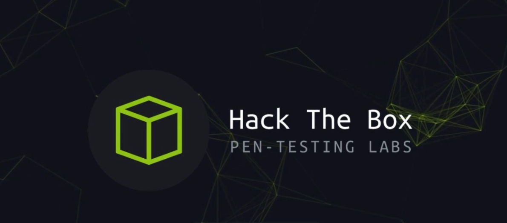
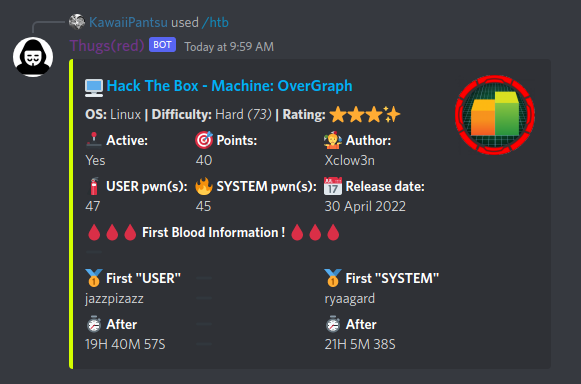
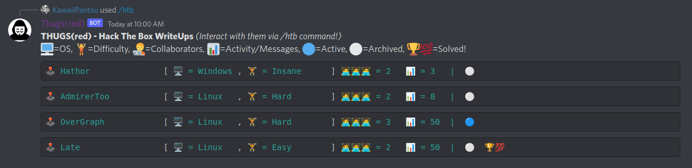
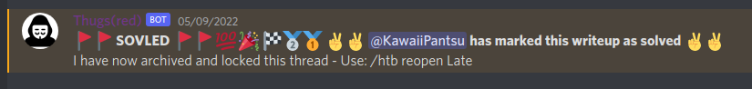
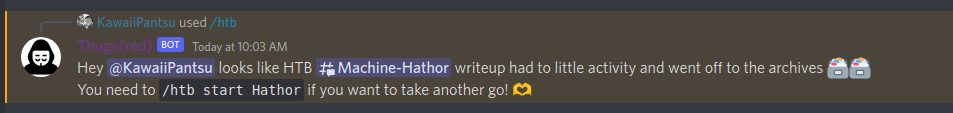

# ᵔᴥᵔ Discord Bot commands for Hack The Box API

[](https://twitter.com/davidbl) [](https://github.com/kawaiipantsu/htb-api-discord-commands/issues) [](https://github.com/kawaiipantsu/htb-api-discord-commands/issues) [](https://github.com/kawaiipantsu/htb-api-discord-commands/blob/master/LICENSE) [](https://github.com/kawaiipantsu/htb-api-discord-commands/network) [](https://github.com/kawaiipantsu/htb-api-discord-commands/stargazers)
> We love Hack The Box and we love Discord :) So bringing them together is alwasys fun and useful. This very simple Discord JS bot adds /htb commands that an be used to starte machine writeups in threads and blast off challenges or just list machines.



---

## Join the community

Join the community of Kawaiipantsu / THUGS(red) and participate in dev talk or simply just come visit us and chat about anything security related :) We love playing around with security. Also we enjoy htb/ctf events and welcome new players to learn what its all about.

**THUGS(red) Discord**: <https://discord.gg/Xg2jMdvss9>


## So what does it do ?

```shell
/htb list                        - Show a list of writeups/threads we have
/htb start [machine-name!]       - Start new HTB machine writeup/thread
/htb tapin [machine-name!]       - Join as collaborator in writeup/thread
/htb tapout [machine-name!]      - Leave as collaborator in writeup/thread
/htb solved [machine-name!]      - Mark HTB machine writeup/thread as solved
/htb reopen [machine-name!]      - sUndo Solved basically :)
/htb info [machine-name!]        - Show HTB Machine information
/htb plzhelp                     - ** Send out a cry for help :)
/htb stats                       - ** Show HTB Ranking stats
/htb challenge [challenge-name!] - Grab a HTB challenge, let everyone play

** = Not implemented yet...
```

## Prerequisite / Install / Running

You need the following things in order to run this bot.

- System
  - Working Node JS installation ( `ver >= 16` )
- Discord information
  - Bot oAuth Token
  - Bot Client ID (Application ID)
  - Guild ID
  - An Admin role ID
  - An Member role ID
  - #general channel ID
  - #hackthebox channel ID
- Hack The Box
  - API token

## Install / Running

```shell
# Download and prepare
git clone https://github.com/kawaiipantsu/htb-api-discord-commands.git
cd htb-api-discord-commands
mv config.example.json config.json
$EDITOR config.json
node install
node deploy-commands.js
node bot.js
```

### `node deploy-commands.js`

This is something you need to run everytime you change the command names etc. You need to notify Discord about the changes first or else the client wont show it properly.

### `node bot.js`

This starts the actual bot, nothing much to say! When you see the following on you terminal:

- `Discord Ready!`

Then its ready to handle commands!

## Screenshots

Here is a bunch of screenshots so you can see it in action :)

- **HTB Machine information**
- 
- **List writeuo/threads on HTB machines**
- 
- **Mark writeup/thread on HTB machine SOLVED!**
- 
- **Some error checking on old archived writeuos/threads etc**
- 
- **Have fun with a Challenge directly in channel**
- 
